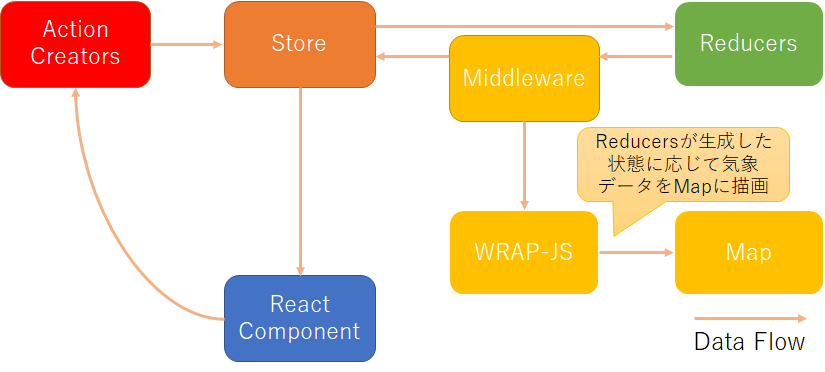

# WRAPアプリケーション開発実践

### 始めに
本項目ではWRAP-JSとReact/Reduxを組み合わせたWRAPアプリケーションの開発方法を解説します。  
[WRAP-JS](https://pt-wrap01.wni.co.jp/Venus/doc/reference/)及び[React/Redux](#/description/reactdev)については知識があることを前提としています。

### ソースコード

本項目は[WRAP-Catalystのソースコード](https://github.com/weathernews/WRAP-Catalyst/)をベースに解説をしていますので、適宜ソースコードを参照してください。  
各ソースコードの関連性については[こちらの概要資料](/content/documents/WRAP-Catalyst Tutorial.pdf)を参照してください。  

また、以下の資料も参考にしてください:

- [Catalyst内のSurface PressureとSea Visibilityの流れ](https://docs.google.com/presentation/d/1rr1zPdbvafOasNS_Mw0Bop3nFfVsigmGORVGCodqQtw/edit#slide=id.p)
- [AMeDASデータ：wrapserverからCatalystまでの流れ](https://docs.google.com/a/wni.com/presentation/d/1hIOVWjNjjVxRGILzA6TbzPe9ReR9bMF0ABfWdYk41vg/edit?usp=sharing)
- [COMPASSデータ：wrapserverからCatalystまでの流れ](https://docs.google.com/a/wni.com/presentation/d/12dE6bs-OjYOipc5ZcPn_qLfu4LZaMgy0l8XlEVTgcWk/edit?usp=sharing)

### 実装の概要
React/ReduxでのWRAP-JSの利用においては、以下のデータフローで実装を行います。  
Reduxが管理する状態（データ）と、WRAP-JSが管理するマップの状態をリンクさせるため、ReduxのMiddlewareを使ってReact/ReduxとWRAP-JSの連携を行います。  



### 実装の流れ
- マップの配置
- WRAP-JSの初期化
- レイヤーの作成
- レイヤーの初期化
- storeの更新
- Middlewareの作成

#### マップの配置
WRAPが提供するGoogleMapコンポーネントをインポートし、配置します。  
コンポーネントに渡すパラメータはAPIリファレンス（準備中）を参照してください。  
*js/containers/main.jsx*  
```js
import GoogleMap from 'WRAP/UI/GoogleMap';
```

```js
render() {
  const { mapOption } = this.props;
  if (!mapOption) {
    return (
      <div>Map Loading...</div>
    );
  }
  return (
    <div id={mapId} style={{ height: '100%', width: '100%', position: 'relative' }}>
      <GoogleMap
        mapSetting={mapOption}
        mapId={gmapId}
        mapInitedCallback={this.mapInitedCallback}
      />
    </div>
  );
}
```

#### WRAP-JSの初期化
WRAPが提供する**WrapController.js**をインポートし、**WrapController.js**経由でWRAP-JSの初期化を行います。  
GoogleMapコンポーネントにより生成されたmapオブジェクトをWRAP Geoに登録する必要があるため、GoogleMapコンポーネントのコールバック内で実行します。  
*js/containers/main.jsx*  
```js
import WrapController from 'WRAP/UI/WrapController';
```
  WRAP Geo/DHに、mapオブジェクトや設定ファイルのパスを**WrapController**経由でセットします。  
  レイヤーを初期化する`WrapController.initLayer`については後ほど説明します。  
```js
mapInitedCallback(map) {
  const { confLayerPath, confDataPath, dhkeyoption, layers, actions, showContents } = this.props;
  const mapDiv = document.getElementById(mapId);
  WrapController.initWRAP(confDataPath, dhkeyoption);  // DHが参照するデータの設定ファイルの格納先をセット
  WrapController.initGoogleMap(map); // Geoにmapオブジェクトをセット
  WrapController.setMapdiv(mapDiv);
  WrapController.initLayer(
    layers, // レイヤー設定の定義
    LayerConfig, // レイヤー名とレイヤーファイルの紐づけ
    confLayerPath,  // レイヤー設定ファイルの格納先
    showContents, // 表示する機能コンテンツリスト
    actions.wrapDispatchAction,  // inspect関数のコールバック等
  ); // レイヤーを初期化
}
```

#### レイヤーの作成
1.レイヤー設定の定義  
各レイヤーの名前や使用する設定ファイル名を定義します。  

*/pri/conf/mapsetting-newest.json*
```js
{
    "layers": [
    {
      "DHObjectName": "CarGPS",
      "layerName": "CarGPS",
      "confName": "CarGPS.json",
      "contentName": "cargps"
    },
    {
      "DHObjectName": "WX_LiveCamera",
      "layerName": "LiveCamera",
      "confName": "LiveCamera.json",
      "contentName": "livecamera"
    }
  ]
}
```

・DHObjectName・・・WRAP DHに登録するデータ識別子  
・layerName・・・WRAP Geoに登録するレイヤー名  
・confName・・・WRAP DHが参照するレイヤーの設定ファイル名  
・contentName・・・機能名  

2.データ設定の配置  
WRAP DHに渡すデータ設定ファイルを作成、配置します。  
*pri/conf/data.CarGps.json*
```js
{
    "Name" : "CarGPS",
    "DataHandler" : "GeoJSON",
    "Attributes" : {
        "File" : "./pri/data/CarGPS/out.json",
        "UpdateInterval" : 60
    }
}
```

3.レイヤー設定の配置  
WRAP Geoに渡すレイヤー設定ファイルを作成、配置します。  
*pri/conf/layer/CarGPS.json*
```js
{
    "Name" : "CarGPS",
    "Renderer" : "GeoJSON",
    "Attributes" : {
        "features" : [
            {
                "style" : {
                    "default" : {
                        "type" : "image",
                        "width" : 32,
                        "height" : 32,
                        "offset_x" : -16,
                        "offset_y" : -16,
                        "url" : "img/car.png"
                    }
                }
            }
        ]
    }
}
```

4.レイヤーファイルの作成  
WRAPの提供する**WrapLayer.js**を継承し、レイヤーを作成します。  
インポートした**WrapLayer.js**をextendsし、constructorとctrlLayer関数を定義します。  
constructorはツールチップ等のレイヤー初期化時に実行したい処理を記載し、ctrlLayer関数にはレイヤーの表示/非表示など、レイヤーを制御する処理を記載します。WrapLayerはWRAP Geoが提供するWRAP.Geo.Layerを継承しているため、setTooltipやsetVisibleなど、WRAP Geoが提供する各種APIの呼び出しが可能です。   
ctrlLayer関数はreduxのstoreに変化があった際に変更後のstoreの値を渡され、自動的に呼ばれるようになっていますので、storeの値に応じてレイヤーをコントロールすることが可能です。  
*/js/layers/CarGpsLayer.js*  
```js
import WrapLayer from 'WRAP/UI/WrapLayer';

class CarGpsLayer extends WrapLayer {
  constructor(conf) {
    super(conf);
    this.setTooltip((geo) => {
      const p = geo && geo.properties;
      if (p) {
        const t = p.valid_time;
        const time = `${t.substr(0, 4)}/${t.substr(4, 2)}/${t.substr(6, 2)}
                      ${t.substr(9, 2)}:${t.substr(11, 2)}:${t.substr(13, 2)}`;
        return `carid : ${p.carid}<br>
            event : ${p.event}<br>
            gps_num : ${p.gps_num}<br>
            gps_q : ${p.gps_q}<br>
            spd : ${p.spd}<br>
            time : ${time}`;
      }
      return null;
    });
  }

  ctrlLayer(type, state) {
    const { cargps } = state;
    this.setVisible(cargps.carGpsChecked);
  }
}

export default CarGpsLayer;
```

5.レイヤー名とレイヤーファイルの紐づけ  
*map-setting-newest.json*で定義したレイヤー名と作成したレイヤーファイルを紐づけます。  
keyにレイヤー名、valueには `{ layer: レイヤーオブジェクト, layerName: レイヤー名 }` の形でimportしたレイヤーオブジェクトを設定してください。  

*js/layers/LayerConfig.js*  
```js
import CarGpsLayer from '../layers/CarGpsLayer';
```

```js
const LayerConfig = {
  CarGPS: { layer: CarGpsLayer, layerName: 'CarGPS' },
};

export default LayerConfig;
```

### レイヤーの初期化
レイヤーの初期化は**WrapController.js**が提供する*initLayer*関数を使用します。  
WRAP-JSの初期化で実装したマップのコールバック関数内で初期化処理を呼び出します。  
*js/containers/main.jsx*  
```js
import WrapController from 'WRAP/UI/WrapController';
```

```js
mapInitedCallback(map) {
  const { confLayerPath, confDataPath, dhkeyoption, layers, actions, showContents } = this.props;
  const mapDiv = document.getElementById(mapId);
  WrapController.initWRAP(confDataPath, dhkeyoption);  // DHが参照するデータの設定ファイルの格納先をセット
  WrapController.initGoogleMap(map); // Geoにmapオブジェクトをセット
  WrapController.setMapdiv(mapDiv);
  WrapController.initLayer(
    layers, // レイヤー設定の定義
    LayerConfig, // レイヤー名とレイヤーファイルの紐づけ
    confLayerPath,  // レイヤー設定ファイルの格納先
    showContents, // 表示する機能コンテンツリスト
    actions.wrapDispatchAction,  // inspect関数のコールバック等
  ); // レイヤーを初期化
}
```

### storeの更新  
storeの更新は通常のReduxと同様ですが、レイヤーの更新を伴う際は、*{ targetLayer：レイヤー名 } *をパラメータとして設定してください。  
targetLayerを設定することでmiddlewareが自動的に対象レイヤーの*ctrlLayer関数*を呼び出します。  
*js/actions/cargps.js*  

```js
import { createActions } from 'redux-actions';
import { CAR_GPS_CLICK } from '../constants/cargps/ActionTypes';
import { CarGPS } from '../layers/LayerConfig';

const checkAction = checked => ({ checked, targetLayer: CarGPS.layerName });

export const {
  carGpsClick,
} = createActions({
  [CAR_GPS_CLICK]: checkAction,
});

```

### Middlewareの作成
store更新時に自動的にレイヤーのコントロール処理（layerCtrler関数）を呼び出す処理を作成します。  
reduxのmiddlewareを使って、以下のように実装してください。  
*js/middleware/layerMiddleware.js*  
```js
import WrapController from 'WRAP/UI/WrapController';

/* eslint-disable no-unused-vars */
export default store => next => (action) => {
  next(action);
  if (action.payload && action.payload.targetLayer) {
    WrapController.ctrlLayer(action.type, action.payload.targetLayer, store.getState());
  }
};
```

作成した処理をMiddlewareへ登録します。  
*js/store/configureStore.dev.js/js/store/configureStore.prod.js*
```js
import { createStore, applyMiddleware } from 'redux';
import { hashHistory } from 'react-router';
import { routerMiddleware } from 'react-router-redux';
import wrapApi from '../middleware/api/wrap';
import layerMiddleware from '../middleware/layerMiddleware';
import rootReducer from '../reducers';

export default function configureStore(initialState) {
  return createStore(
    rootReducer,
    initialState,
    applyMiddleware(wrapApi, layerMiddleware, routerMiddleware(hashHistory)),
  );
}

```
