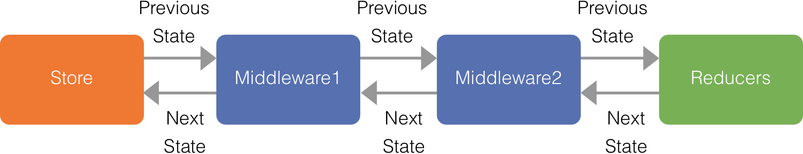

### 通信処理
ここでは、通信処理の作成方法を説明します。

#### サンプルアプリケーション
通信処理の説明にサンプルアプリケーションを使用しています。  
実行方法は以下のとおりです。
```
cd examples/async
npm install
npm run dev
```
ブラウザにアクセス  
`http://localhost:3000`

#### 通信処理で使用するモジュール
以下のモジュールを使用します。詳細についてはリンク先を参照してください。

| モジュール            | Version           | 説明           |
| ------------- |-------------|-------------|
| [isomorphic-fetch](https://github.com/matthew-andrews/isomorphic-fetch)   | ~2.2.1 |非同期通信ライブラリ

#### 通信処理のファイル
通信処理のファイルは以下の規約に従って作成してください。

|             | 規約           
| ------------- |-------------
| 配置場所 | `js/middleware/api/`
| ファイル名 | `通信内容を表す名前` + `.js` e.g.`photo.js`

#### 複数の通信処理
通信処理は汎用的に作成することを意識してください。多くの場合、通信処理は汎用的に作成することが可能であり、開発、テスト工数を削減することが出来ます。

#### 通信処理の作成
通信処理はMiddlewareとして作成してください。

#### （補足）Middlewareとは
MiddlewareはReducerの実行前後に処理を追加させる仕組みです。



#### Actionのタイプ値作成
以下に従って、通信処理で使用するActionのType値を作成してください。
* js/constants/ActionTypes.js

| 値            | 説明           | 用途           |
| ------------- |-------------|-------------|
| *_REQUEST   | リクエスト開始のAction |ローディングなどを表示します
| *_SUCCESS   | 通信成功のAction      |取得したデータを画面に表示します
| *_FAILURE   | 通信失敗のAction      |通信が失敗したメッセージを表示します

プレフィックスには、通信内容を表す値を指定してください。

作成例
```js
export const PHOTO_REQUEST = 'PHOTO_REQUEST';
export const PHOTO_SUCCESS = 'PHOTO_SUCCESS';
export const PHOTO_FAILURE = 'PHOTO_FAILURE';
```

#### Action Creatorの作成
以下に従って、通信処理で使用するAction Creatorを作成してください。
* js/actions/index.js
※必要に応じてファイル名は「index.js」以外を指定してください。

API名を取得します。詳細は後ほど説明します。
```js
import { PHOTO_API } from '../middleware/api/photo';
```

Action Creatorの第1引数には、先ほどインポートした値を指定します。`types`プロパティには、作成済みのActionのタイプ値を配列で指定します。その他のプロパティにはURLやPOSTデータなど、通信に必要なプロパティを作成してください。

作成例
```js
export const find = createAction(
  PHOTO_API,
  () => ({
    types: [PHOTO_REQUEST, PHOTO_SUCCESS, PHOTO_FAILURE],
    endpoint: 'http://localhost:3000/photos',
  }),
);
```

#### 通信処理の作成
以下に従って、通信処理を作成してください。
* js/middleware/api/通信内容.js

通信処理の呼び出しに使用するAPI名を作成します。API名は以下に従って作成してください。

|             | 規約           
| ------------- |-------------
| API名 | `通信内容を表す名前` + `API`
| 値 | Symbol値を定数に代入

作成例
```js
export const PHOTO_API = Symbol('PhotoAPI');
```

通信処理をMiddlewareに作成します。

作成例
```js
/* eslint-disable no-unused-vars */
export default store => next => (action) => {
  const callApi = action.type;

  // 通信処理とは関係ないActionの場合、Middlewareの処理を終了させます。
  if (callApi !== PHOTO_API) {
    return next(action);
  }

  // 通信に必要なデータを取得します。必要であればPOSTデータなども取得します。
  const { types, endpoint } = action.payload;
  // 先ほど作成したActionのType値を取得します。
  const [requestType, successType, failureType] = types;

  // リクエスト開始のActionを発行します。
  next({ type: requestType });

  // 通信を開始します。
  return fetch(endpoint)
    .then(response => response.json().then(json => ({ json, response })))
    .then(({ json, response }) => {
      if (!response.ok) {
        return Promise.reject(json);
      }
      // 通信成功の処理を記載します。

      // 通信成功のActionを発行します。
      next({ type: successType,
        payload: { data: json },
      });
      return null;
    })
    .catch((json) => {
      // 通信失敗の処理を記載します。

      // 通信失敗のActionを発行します。
      next({ type: failureType,
        payload: { error: json.msg },
      });
    });
};
```


#### Reducerの作成
通信用のReducerを作成します。作成方法は通常のReducerと同じです。
* js/reducers/reducer名.js

作成例
```js
const initialState = { data: [], isFetching: false };

export default handleActions({

  // 通信が開始したことを表すフラグをtrueにします。
  // こちらのフラグを使用してローディングなどを表示します。
  [PHOTO_REQUEST]: state =>
    Object.assign({}, state, { isFetching: true }),

  // 通信で取得したデータをStoreに返します。
  // 通信が開始したことを表すフラグはfalseにします。
  // こちらのフラグを使用して表示していたローディングを閉じます。
  [PHOTO_SUCCESS]: (state, action) =>
    Object.assign({}, state, { data: action.payload.data, isFetching: false }),

  // 通信が開始したことを表すフラグはfalseにします。
  // こちらのフラグを使用して表示していたローディングを閉じます。
  [PHOTO_FAILURE]: state =>
    Object.assign({}, state, { isFetching: false }),

}, initialState);

```