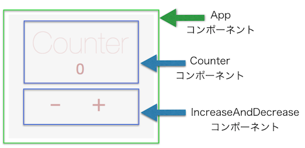
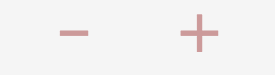
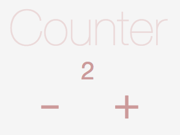
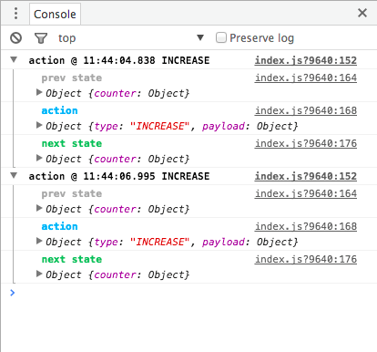

### ボイラープレートを使った開発の流れ
当ガイドが提供するボイラープレートの使用方法を説明します。ボイラープレートを使用することにより、当ガイドが推奨する構成で直ちにSPAの開発に取り掛かることが出来ます。

#### 構文チェック
当ガイドが提供する開発環境では、WRAPで設定したコーディングルールに従ってESLintによる構文チェックが行われます。

Atom上でソースコードを編集すると、オンタイムで構文チェックが行われます。

ソースコードの中に構文の間違いや、規約違反が存在する場合は以下のようなエラーが表示されます。


エラーが表示された場合は、メッセージの先頭にあるエラーネームを検索することで、詳しいエラー内容を参照することができます。
上のケースでは"ESlint semi"や"ESlint no-var"と検索すると、エラーの詳細が掲載されたサイトを探すことができます。

また、ソースコード内にエラーが存在する状態でコンパイルを行うと、以下のようなメッセージが表示されコンパイルエラーとなります。


コード内のエラーを全て取り除き、再度コンパイルを行ってください。


#### ボイラープレートの起動
ガイドに同梱されている`boilerplate`を使用します。ディレクトリの名前はプロジェクト名に変更します。ここではcounterに変更したとします。

プロジェクトに必要なモジュールをダウンロードします。
```
cd counter
npm install
```

アプリケーションを開発モードで起動します。
```
npm run dev
```

ブラウザにアクセスします。  
`http://localhost:3000`

以下の画面を確認することが出来ます。


#### ボイラープレートを使用したアプリケーションの開発例
それでは実際に、ボイラープレートを使用したアプリケーションの開発例を説明していきたいと思います。作成するアプリケーションは以下のとおり、3つのコンポーネントで構成された簡単なカウントアプリケーションです。

   
IncreaseAndDecreaseコンポーネントのプラス、もしくはマイナスボタンを押下することにより、Counterコンポーネントのカウントが増減します。


アプリケーションを以下の順序で作成していきます。
1. プレゼンテーショナルコンポーネントの作成  
2. Action Creatorの作成
3. Reducerの作成
4. コンテナーコンポーネントの作成


##### 1. プレゼンテーショナルコンポーネントの作成
最初にアプリケーションのUIを作成します。CounterコンポーネントとIncreaseAndDecreaseコンポーネントをプレゼンテーショナルコンポーネントとして作成します。

最初に、以下のとおり、Counterコンポーネントに必要なファイルを作成します。
* js/components/Counter.jsx
* style/counter.css

Couter.jsxにコンポーネントを記述します。
```js
import React from 'react';
import PropTypes from 'prop-types';
import css from '../../style/counter.css';

const propTypes = { count: PropTypes.number };

const Counter = props => (
  <div className={css.container}>
    <h1 className={css.title}>Counter</h1>
    <h3 className={css.count}>{props.count}</h3>
  </div>
);

Counter.propTypes = propTypes;
export default Counter;

```
counter.cssにCounterコンポーネントに必要なスタイルを記述します。
```css
.container {
  width: 100%;
  text-align: center;
}

.title {
  margin: 0 auto;
  font-size: 80px;
  font-weight: 100;
  color: #ebd9d9;
}

.count {
  margin: 0 auto;
  font-size: 40px;
  font-weight: 400;
  color: #cc9a9a;
}
```

Counterコンポーネントが正しく表示されることを確認します。親コンポーネントとなる以下ファイルにCounterコンポーネントを追加します。SampleContentコンポーネントはボイラープレートに事前に準備されている
アプリケーションのエントリーポイントから呼び出されるコンテナーコンポーネントです。

* js/container/SampleContent.jsx

修正前
```js
<div className={css.container}>
  // 以下のコードは削除
  <h1 className={css.title}>Hello SPA</h1>
</div>
```

修正後
```js
import Counter from '../components/Counter';

<div className={css.container}>
  // 以下のコードを追加
  <Counter count={0} />
</div>
```

確認します。ブラウザのリロードは不要ですので、UIの開発をストレスなく行なうことが出来ます。


次に、以下のとおり、IncreaseAndDecreaseコンポーネントに必要なファイルを作成します。
* js/components/IncreaseAndDecrease.jsx
* style/increase-and-decrease.css

IncreaseAndDecrease.jsxにコンポーネントを記述します。
```js
import React from 'react';
import PropTypes from 'prop-types';
import css from '../../style/increase-and-decrease.css';

/* eslint-disable react/no-unused-prop-types */
const propTypes = { decrease: PropTypes.func.isRequired, increase: PropTypes.func.isRequired };

const IncreaseAndDecrease = props => (
  <div className={css.container}>
    <button className={css.btn} onClick={() => props.decrease(1)} >-</button>
    <button className={css.btn} onClick={() => props.increase(1)} >+</button>
  </div>
);

IncreaseAndDecrease.propTypes = propTypes;
export default IncreaseAndDecrease;

);

IncreaseAndDecrease.propTypes = propTypes;
export default IncreaseAndDecrease;

```

increase-and-decrease.cssにIncreaseAndDecreaseコンポーネントに必要なスタイルを記述します。
```css
.container {
  width: 100%;
  text-align: center;
}

.btn {
  outline: none;
  border: 0;
  background: none;
  position: relative;
  margin: 0 2rem;
  height: 60px;
  width: 60px;
  font-size: 4rem;
  line-height: 1.5rem;
  color: #cc9a9a;
}
```

IncreaseAndDecreaseコンポーネントが正しく表示されることを確認します。Counterコンポーネントと同様にSampleContent.jsxに追加します。

修正後
```js
import IncreaseAndDecrease from '../components/IncreaseAndDecrease';

<div className={css.container}>
  <Counter count={0} />
  // 以下のコードを追加
  <IncreaseAndDecrease />
</div>
```

確認します。同じくブラウザのリロードは不要です。




##### 2. Action Creatorの作成
続いて、コンポーネントから呼び出すAction Creatorを作成します。

最初に、事前に準備されている以下のファイルにActionのタイプ値を記述します。タイプ値は、Action Creatorが作成するActionを、Reducerがどのように処理するかの判定に使用します。
* js/constants/ActionTypes.js

```js
export const INCREASE = 'INCREASE';
export const DECREASE = 'DECREASE';
```
次に、Action Creatorに必要な以下のファイルを作成します。
* js/actions/index.js

actions/index.jsにAction Creatorを記述します。
```js
import { createAction } from 'redux-actions';
import { INCREASE, DECREASE } from '../constants/ActionTypes';

export const increase = createAction(INCREASE, num => ({ amount: num }));
export const decrease = createAction(DECREASE, num => ({ amount: num }));

```

##### 3. Reducerの作成
続いて、Action Creatorが作成するActionを元にアプリケーションの状態を変更するReducerを作成します。

Counterアプリケーションに必要な状態はカウント数です。そのため、カウント数を計算するReducerを作成します。カウント数の初期値は0とします。Reducerが返す値をStoreがアプリケーションの状態として管理することになります。

Counterアプリケーションの状態を計算するReducerのため、Reducer名はcounterとし、ファイルを作成します。counter.jsにReducerを記述します。
* js/reducer/counter.js

```js
import { handleActions } from 'redux-actions';
import { INCREASE, DECREASE } from '../constants/ActionTypes';

const initialState = { number: 0 };

const counter = handleActions({

  [INCREASE]: (state, action) => (
    { number: state.number + action.payload.amount }
  ),

  [DECREASE]: (state, action) => (
   { number: state.number - action.payload.amount }
  ),
}, initialState);
export default counter;

```

追加したReducerを以下に設定します。

* js/reducer/index.js

```js
import { combineReducers } from 'redux';
import counter from './counter';

const rootReducer = combineReducers({
  counter,
});

export default rootReducer;

```

##### 4. コンテナーコンポーネントの作成
最後に、以下の連携を行なうコンテナーコンポーネントを作成します。

* プレゼンテーショナルコンポーネントとAction Creatorの連携
* Storeで管理している状態をコンポーネントに連携

事前に準備されている以下のファイルを編集します。
* js/container/SampleContent.jsx

最初に、Action Creatorをコンポーネント内で使用出来るようにします。

先ほど作成したAction Creatorをインポートします。
```js
import * as CounterActions from '../actions';
```

事前に定義済みの`mapDispatchToProps`を編集します。
```js
function mapDispatchToProps(dispatch) {
  return {
    actions: bindActionCreators(CounterActions, dispatch),
  };
}
```
これで、コンポーネントからAction Creatorが呼び出せるようになりました。

次に、Storeが管理する状態をコンポーネント内で使用出来るようにします。

事前に定義済みの`mapStateToProps`を編集します。
```js
function mapStateToProps(state) {
  return {
    number: state.counter.number,
  };
}
```
これで、コンポーネントからStoreが管理している状態を使用出来るようになります。また、Storeの状態が変更するとReactが自動的に再レンダリングします。

最後に、プレゼンテーショナルコンポーネントを修正します。

プレゼンテーショナルコンポーネントに先ほどのAction Creator、Storeの値を設定します。
```js
render() {
  const { number, actions } = this.props;
   return (
     <div className={css.app}>
      <Counter count={number} />
      <IncreaseAndDecrease
        increase={actions.increase}
        decrease={actions.decrease}
      />
    </div>
  );
}

```

propsで受け取る値をチェックするための処理を追加します。
```
import React, { Component } from 'react';
import PropTypes from 'prop-types'; // PropTypes追加
import { bindActionCreators } from 'redux';
import { connect } from 'react-redux';
```

```
// 追加
const propTypes = { number: PropTypes.number, actions: PropTypes.object };

class SampleContent extends Component {
  render() {
    const { number, actions } = this.props;
```

```
// 追加
SampleContent.propTypes = propTypes;

export default connect(
  mapStateToProps,
  mapDispatchToProps,
)(SampleContent);
```

SampleContent.jsxの全体は以下になります。
```js
import React, { Component } from 'react';
import PropTypes from 'prop-types';
import { bindActionCreators } from 'redux';
import { connect } from 'react-redux';
import css from '../../style/sample-content.css';
import Counter from '../components/Counter';
import IncreaseAndDecrease from '../components/IncreaseAndDecrease';
import * as CounterActions from '../actions';

const propTypes = { number: PropTypes.number, actions: PropTypes.object };

class SampleContent extends Component {
  render() {
    const { number, actions } = this.props;
    return (
      <div className={css.app}>
        <Counter count={number} />
        <IncreaseAndDecrease
          increase={actions.increase}
          decrease={actions.decrease}
        />
      </div>
    );
  }
}


function mapStateToProps(state) {
  return {
    number: state.counter.number,
  };
}

function mapDispatchToProps(dispatch) {
  return {
    actions: bindActionCreators(CounterActions, dispatch),
  };
}

SampleContent.propTypes = propTypes;

export default connect(
  mapStateToProps,
  mapDispatchToProps,
)(SampleContent);

```

アプリケーションが動作することを確認します。`connect()`の内容を変更した場合はリロードが必要になります。

以下はプラスボタンを2回押下したアプリケーションの画面です。



開発モードの場合、アプリケーションの状態変化は全てコンソールログに出力されますので、デバッグに役立ちます。


