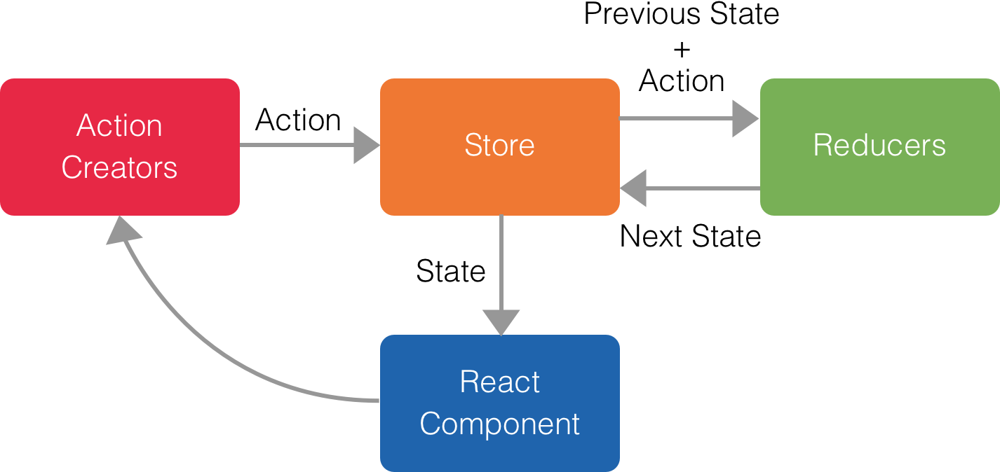
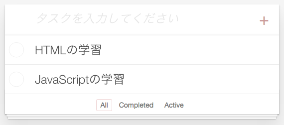
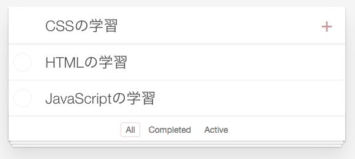
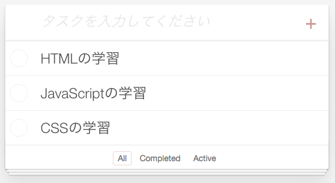

### アーキテクチャとデータフロー
アプリケーションのアーキテクチャとデータフローは以下になります。UIにReact、状態管理にReduxを使用したアーキテクチャを採用しています。データフローはこれまでのMV*フレームワークと異なり、シンプルな一方向になります。

こちらのアーキテクチャはFacebookが提唱しているFluxアーキテクチャを参考にして作成されています。Fluxアーキテクチャが初めての方は[Flux Overview](https://facebook.github.io/flux/docs/overview.html)などでFluxアーキテクチャを理解していると、当ガイドの理解が容易になります。



#### 役割
それぞれの役割は以下のとおりです。
* ###### React Component
React ComponentはUIの表示、イベントの受け付けをします。イベントを受け付けた場合、Action Creatorsに通知します。その結果、Storeから返されたアプリケーションの新しい状態でUIを表示します。

* ######  Action Creators
Action Creatorsはイベントに応じたActionを作成します。作成したActionはStoreに引き渡します。

* ######  Store
Storeはアプリケーションの状態を管理します。受け取ったActionと現在管理している状態をReducerに引き渡します。その結果、Reducersから返された新しい状態を管理するとともに、その状態をReact Componentに引き渡します。

* ######  Reducers
Reducersはアプリケーションの新しい状態を作成します。受け取ったActionと現在の状態から新しい状態を作成し、Storeに引き渡します。

#### データフロー
以下のケースでデータフローを説明します。

アプリケーションを起動し、下のようにタスクを2件追加したとします。


この場合、Storeに保存されているアプリケーションの状態は以下のオブジェクトになります。
```js
{
  todos: [
    { id: 0, text: "HTMLの学習", completed: false },
    { id: 1, text: "JavaScriptの学習", completed: false }
  ],
  visibilityFilter: "SHOW_ALL"
}
```
この状態から、さらに1件のタスクを追加するとします。

###### 1. React Component
新しいタスクが入力され、`+`ボタンが押下された場合、タスク追加のイベントが発生したことをAction Creatorsに通知します。



###### 2. Action Creators
通知を受けたAction Creatorsはタスク追加のActionを作成し、Storeに引き渡します。

この場合、作成したActionは以下のオブジェクトになります。
```js
{
  type: "ADD_TODO",
  payload: {
    id: 2,
    text: "CSSの学習",
  }
}
```

###### 3. Store
受け取ったActionと現在管理している状態をReducerに引き渡します。

この場合、Reducerに引き渡すのは以下のオブジェクトになります。

Action
```js
{
  type: "ADD_TODO",
  payload: {
    id: 2,
    text: "CSSの学習",
  }
}
```

現在管理している状態
```js
{
  todos: [
    { id: 0, text: "HTMLの学習", completed: false },
    { id: 1, text: "JavaScriptの学習", completed: false }
  ],
  visibilityFilter: "SHOW_ALL"
}
```

###### 4. Reducers
受け取ったActionと現在の状態から、新しいタスクを追加した以下の状態を作成します。作成した新しい状態はStoreに引き渡します。

この場合、作成した新しい状態は以下のオブジェクトになります。
```js
{
  todos: [
    { id: 0, text: "HTMLの学習", completed: false },
    { id: 1, text: "JavaScriptの学習", completed: false },
    // ↓ Reducerが追加したデータ
    { id: 2, text: "CSSの学習", completed: false }
  ],
  visibilityFilter: "SHOW_ALL"
}
```

###### 5. Store
受け取った新しい状態を管理するとともに、React Componentにその状態を引き渡します。

この場合、React Componentに引き渡すのは以下のオブジェクトになります。

新しい状態
```js
{
  todos: [
    { id: 0, text: "HTMLの学習", completed: false },
    { id: 1, text: "JavaScriptの学習", completed: false },
    { id: 2, text: "CSSの学習", completed: false }
  ],
  visibilityFilter: "SHOW_ALL"
}
```

###### 6. React Component
受け取った状態をもとにアプリケーションを描画します。



アプリケーションの状態を変更するには、全てこのデータフローに従ってください。
