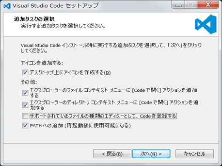
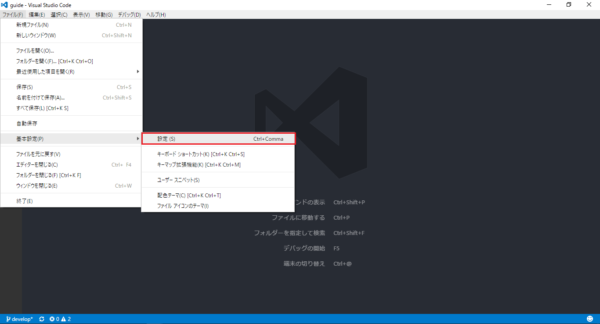
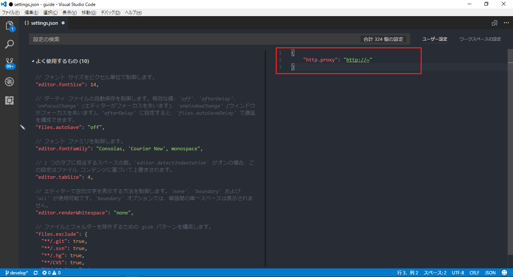
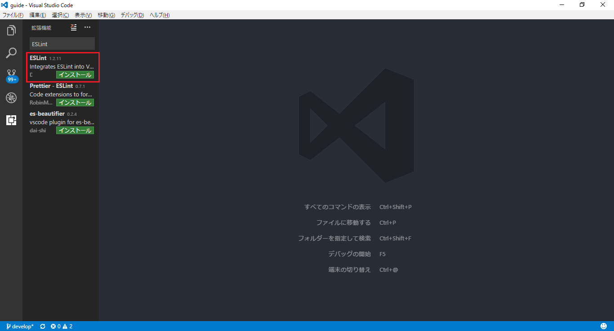

### Visual Studio Codeとは
Visual Studio Codeとは、MicroSoftによって提供されているオープンソースのテキストエディターです。ここではVisual Studio Codeを使用したコーディング環境の準備を行います。

#### Visual Studio Codeのインストール

##### インストーラのダウンロード

以下のサイトからインストーラをダウンロードしてください。

https://code.visualstudio.com/

##### インストール

インストーラを実行し、インストールを開始してください。  
途中で表示されるオプション（追加タスクの選択）は好みに合わせて設定してください。  


#### proxyの設定(必要な場合のみ)

Visual Studio Codeにパッケージをインストールするためにproxyの設定を行います。

1.Visual Studio Codeを起動しメニューからファイル→基本設定→設定を選択


2.setting.jsonが開かれるので、以下のようにproxyを設定
```
{
    "http.proxy": "http://~"
}
```


#### 「ESLint」プラグインのインストール

ESLintとはJavaScriptの構文チェックツールであり、自分の書いているコードが、設定したルールの通りに書かれているかをリアルタイムでチェックすることができます。
Visual Studio CodeにはESLintに対応したプラグインが用意されているので、それを利用します。

拡張機能メニューから「ESLint」を検索し、インストールを行って下さい。  
